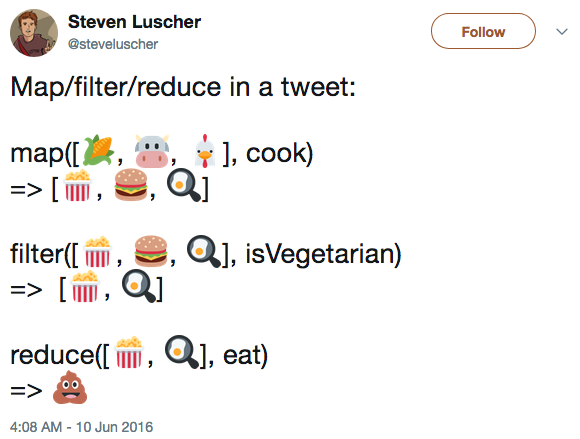

# Introduction

📌 Learning objectives:

- know what is what
- understand the (relatively) recent JavaScript syntax
- be able to design a JavaScript library


## What is React?

- JavaScript library for building User Interfaces (UIs)
- Facebook Open Source
- **Learn Once, Write Anywhere**

<br>
Documentation: https://facebook.github.io/react/


## What is Flux?

- Application architecture (pattern) for building client-side web applications
- Facebook Open Source
- **Unidirectional data flow**

<br>
Documentation: https://facebook.github.io/flux/


## What is Redux?

[Redux](http://redux.js.org/) is *one* (partial) implementation of the Flux
pattern. It is now the reference and works well with React.

More about it later!


## Modern JavaScript


### ES5

**ES** stands for **ECMAScript** and is the language specification used to
implement JavaScript.

ES5 is supported by all browsers, but lacks very interesting features. It is the
JavaScript language you likely know. `jQuery` used to be a great library back
then 😅


### ES2015 (ES6)

Released around 2009, this is likely the most important update to the JavaScript
language.

Most of the modern browsers (_e.g._ Chrome) support it but to maximize
compatibility, we tend to use a transpiler (_e.g._ [Babel](https://babeljs.io/))
to convert down to ES5.


#### Block scoped declarations

ES2015 introduces two keywords to declare variables:

- `const`: can only be assigned once
- `let`: can be reassigned

Both `const` and `let` are scoped to a block, not to a function like `var`. Do
not use `var` anymore, you should use `const` as much as you can.


#### Block scoped declarations – Example

``` javascript.player.transpiler
const a = 1;
let str = 'Hello, World';

// will throw a compiler error
// a = 42;

// this is ok
str = 'Nope';

if (true) {
    const a = 123;
}
```


#### Arrow functions

``` javascript.player.transpiler
const foo = () => 'bar';

this.items.map(x => this.doSomethingWith(x));

const odds = evens.map(v => v + 1);
const pairs = evens.map(
  v => ({ even: v, odd: v + 1 })
);

const bar = () => {
  // do something ...
  return 'val';
};
```

[MDN Arrow
functions](https://developer.mozilla.org/en/docs/Web/JavaScript/Reference/Functions/Arrow_functions)


#### Destructuring

``` javascript.player.transpiler
// arrays
const values = ['one', 'two', 'three', 'four'];
const [one, two, ...others] = values;

// objects
const props = { a: 'x', b: 'y', c: 'z' };
const { a, c } = props;

// in functions
function foo({ x }) {
  console.log(x);
}
```

[MDN Destructuring
assignment](https://developer.mozilla.org/en-US/docs/Web/JavaScript/Reference/Operators/Destructuring_assignment)


#### Imports/Exports

- One **default** export per file
- Every other import and export must be named


#### Imports – Example

``` javascript.player.transpiler
// import the default export
import React from 'react';

// import other named exports
import { Component, Children } from 'react';

// import default and others simultaneously
// import React, { Component, Children } from 'react';
```


#### Exports – Example

``` javascript.player.transpiler
const React = () => {};

// default export
export default React;

// named export
export const Component = () => {};
export const PI = 3.14;
```


#### Template literals (strings)

``` javascript.player.transpiler
// multiline strings
const multiline = `string text line 1
string text line 2`;

// interpolation <3
const val = 12;
const message = `Cost: ${val} euros`;

const alt = `this is ${val || 'undefined'}`;
```

[MDN Template
literals](https://developer.mozilla.org/en-US/docs/Web/JavaScript/Reference/Template_literals)


#### Tagged template literals

Tags allow you to parse template literals with a function. Have a look at the
[common-tags](https://github.com/declandewet/common-tags) library for examples:

``` js
import { oneLine } from 'common-tags';

oneLine`
  foo
  bar
  baz
`
// "foo bar baz"
```


#### Default parameters

``` javascript.player.console
const sayHello = (name = 'World') => {
  console.log(`Hello, ${name}!`);
};

sayHello();
sayHello('Jean');

// default value is used iif name is `undefined`
sayHello(null);
```


#### Classes

``` javascript.player.console
class Calculator {
  constructor(value1, value2) {
    this.value1 = value1;
    this.value2 = value2;
  }

  static multiply(value1, value2) {
    return value1 * value2;
  }

  sum() {
    return this.value1 + this.value2;
  }
}

const calc = new Calculator(2, 3);

console.log(calc.sum());
console.log(Calculator.multiply(2, 3));
```


### Enhanced Object Literals

``` javascript.player.transpiler
const id = 123;
const name = 'John Doe';

const user1 = { id, name };

const user2 = { id, name: 'Babar' };
```

[MDN Object
literals](https://developer.mozilla.org/en-US/docs/Web/JavaScript/Guide/Grammar_and_types#Object_literals)


#### Dynamic object keys

``` javascript.player.console
const attribute = 'color';
const style = {
  [attribute]: 'white',
};

console.log(style.color);
```


#### Array spread

``` javascript.player.console
const foo = ['a', 'b', 'c'];
const bar = ['d', 'e', 'f'];

console.log(...foo);
console.log([...foo, ...bar]);
```

[MDN Spread
syntax](https://developer.mozilla.org/en-US/docs/Web/JavaScript/Reference/Operators/Spread_operator)


### ESNext


#### Static class properties

``` javascript.player.console
class Foo {
  static bar = 'hello';
}

console.log(Foo.bar);
```


#### Object Spread

``` javascript.player.console
const defaultStyle = {
  color: 'black',
  fontSize: 12,
  fontWeight: 'normal',
};

const style = {
  ...defaultStyle,
  fontWeight: 'bold',
  backgroundColor: 'white',
};

console.log(style);
```


#### Async/Await

The purpose of `async`/`await` functions is to simplify the behavior of using
promises synchronously.

``` js
const printJSON = (endpoint) => {
  // Promise chain
  return fetch(endpoint) // return a Promise
    .then(response => response.json())
    .then(json => {
      console.log(json);
    })
    .catch(error => {
      console.error(error);
    });
};
```


#### Async/Await – Example

``` js
const printJSON = async (endpoint) => {
  try {
    const response = await fetch(endpoint);
    const json = await response.json();

    console.log(json);
  } catch (error) {
    console.error(error);
  }
};
```

[MDN Async
Function](https://developer.mozilla.org/en-US/docs/Web/JavaScript/Reference/Statements/async_function)


### Reminder: Map/Filter/Reduce




<!-- .slide: class="hands-on" -->
## 🚀 Hands-on

Let's start by creating a new project:

```
$ mkdir -p react/seq-utils
$ cd !$
$ git init
```


<!-- .slide: class="hands-on" -->
### Exercise 1.1

In a `index.js` file, write a `generate()` function to randomly generate DNA
sequences. This function must be written in ES2015 and exported.

A sequence has a unique identifier `id`, a `name` and the `dna` sequence itself,
compound of letters (_nucleotides_):

``` js
{
  id: 123456,
  name: 'name of the sequence',
  dna: 'ATCG...'
}
```


<!-- .slide: class="hands-on" -->
### Solution 1.1

``` js
// index.js
export const generate = () => {
  const nucleotides = ['A', 'T', 'C', 'G'];
  const length = Math.round(Math.random() * 90) + 10;

  const s = [];
  for (let i = 0; i < length; i++) {
    s.push(nucleotides[Math.floor(Math.random() * nucleotides.length)]);
  }

  return {
    id: `TD${new Date().getTime()}${length}`,
    name: `Sequence ${length}`,
    dna: s.join(''),
  };
};
```

Does it actually work?


## Unit testing

Hello [Jest](https://facebook.github.io/jest/), a powerful JavaScript testing
framework:

``` bash
$ npm init # accept all the default settings
$ npm install jest --save-dev
```

``` bash
$ ./node_modules/.bin/jest
No tests found
```

You can also put this into your shell config to avoid typing the relative path
to the tools installed _via_ NPM:

``` bash
export PATH="$PATH:./node_modules/.bin"
```

``` bash
$ jest
```


### Jest 101

``` js
// index.test.js
import { generate } from './index';

test('it generates sequences', () => {
  // TODO: add assertions
});
```

<br>
Documentation: https://facebook.github.io/jest/


### Jest + Babel = ❤️

``` bash
$ jest
 FAIL  ./index.test.js
  ● Test suite failed to run

    /path/to/react/seq-utils/index.test.js:2
    import { generate } from './index';
    ^^^^^^

    ...
```

``` bash
$ npm i --save-dev babel-jest babel-preset-es2015 regenerator-runtime
$ echo '{ "presets": ["es2015"] }' > .babelrc
```


### It works™

``` bash
$ jest
 PASS  ./index.test.js
  ✓ it generates sequences (3ms)

Test Suites: 1 passed, 1 total
Tests:       1 passed, 1 total
Snapshots:   0 total
Time:        2.701s
Ran all test suites.
```

Edit `package.json` to update the `test` script entry:

``` json
"scripts": {
  "test": "jest"
}
```

``` bash
$ npm test
```


<!-- .slide: class="hands-on" -->
## 🚀 Hands-on


<!-- .slide: class="hands-on" -->
### Exercise 1.2

1. Install the testing dependencies in your project
2. Write a unit test for your `generate()` function


<!-- .slide: class="hands-on" -->
### Solution 1.2

``` js
// index.test.js
import { generate } from './index';

test('it generates sequences', () => {
  const seq = generate();

  expect(seq.id).toBeDefined();
  expect(seq.name).toBeDefined();
  expect(seq.dna).toBeDefined();
});
```

Can we share it?


## Transpilation with Babel

Transpilation means converting JavaScript ES2015 into JavaScript ES5 to maximize
compatibility.

``` bash
$ npm i --save-dev babel-cli
```

``` bash
$ ./node_modules/.bin/babel index.js --out-dir dist/
index.js -> dist/index.js
```

<br>
Documentation: https://babeljs.io/


### NPM scripts

NPM scripts are custom scripts that can be run with `npm run`. It is similar to
`Makefile` targets, except that they are bundled in the `package.json` file:

``` js
"scripts": {
  "test": "jest",
  "build": "babel index.js --out-dir dist/"
}
```

``` bash
$ npm run build
```


### Create a NPM module (1/2)

1. Overriding the main module in `package.json`:

  ``` js
  {
     "main": "dist/index.js",
     ...
  }
  ```

2. Create a `.npmignore` file:

  ``` bash
  $ echo "*.js\n*.tgz\n.babelrc" > .npmignore
  ```

3. Create a `.gitignore` file:

  ``` bash
  $ echo 'coverage/' >> .gitignore
  $ echo 'dist/' >> .gitignore
  $ echo 'node_modules/' >> .gitignore
  $ echo '*.tgz' >> .gitignore
  ```


### Create a NPM module (2/2)

4\. Add a hook to automatically build the dist files:

  ``` json
  "scripts": {
    "build": ...,
    "prepare": "npm run build"
  }
  ```

That's it! Now we can package the library:

``` bash
$ npm pack
```

``` bash
$ tar tf seq-utils-1.0.0.tgz
package/package.json
package/dist/index.js
```


### Publish a NPM module

Follow the instructions to set your NPM author info at:
https://gist.github.com/coolaj86/1318304. Then, publish:

```
$ npm publish ./
```

<br>

⚠️ Please, do not do that during the training session.


<!-- .slide: class="hands-on" -->
## 🚀 Hands-on


<!-- .slide: class="hands-on" -->
### Exercise 1.3

1. Create a NPM module


<!-- .slide: class="hands-on" -->
### Exercise 1.4

In the sequel, we will use [NtSeq](https://github.com/keithwhor/NtSeq), a
library to manipulate sequences. Let's add a `createSequenceFromDNA()` function
returning a `Seq` instance given a DNA sequence:

``` js
const seq = createSequenceFromDNA('ATCG');
```

1. Require `ntseq`
2. Add a new exported function to your module
3. Add a test case


## Code coverage

``` bash
$ ./node_modules/.bin/jest --coverage
```

``` bash
 PASS  ./index.test.js
  ✓ it generates sequences (3ms)
  ✓ it returns a Seq instance from a sequence (2ms)

Test Suites: 1 passed, 1 total
Tests:       2 passed, 2 total
Snapshots:   0 total
Time:        0.795s, estimated 1s
Ran all test suites.
----------|---------|----------|---------|---------|----------------|
File      | % Stmts | % Branch | % Funcs | % Lines |Uncovered Lines |
----------|---------|----------|---------|---------|----------------|
All files |     100 |      100 |     100 |     100 |                |
 index.js |     100 |      100 |     100 |     100 |                |
----------|---------|----------|---------|---------|----------------|
```
