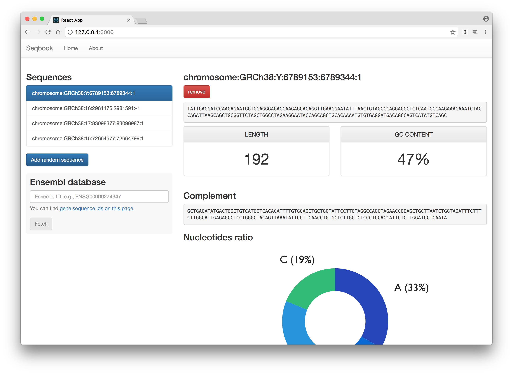

# Writing components

📌 Learning objectives:

- Learn React


## Create React App

Create React apps with no build configuration:

- Start building an app directly
- No configuration hassle
- Great default settings
- Eject mode

```
$ npm install -g create-react-app
```


## 🚀 Hands-on

1. Install `yarn`: https://yarnpkg.com/lang/en/docs/install/
2. Create a new React project:

``` bash
$ cd react
$ create-react-app seqbook
```

``` bash
$ cd seqbook
$ git init
$ git add . && git commit -m "Initial commit"
```


## ~/react/seqbook

> Seqbook is a DNA sequences book. Users will be able to manipulate sequences,
> fetch sequences from an online database, and visualize different metrics.

```
.
├── README.md
├── node_modules/
├── package.json
├── public/
├── src/
└── yarn.lock
```


## 


## The JSX syntax

JSX is an extension of the JavaScript syntax. More precisely, it is an alias for
`React.createElement()`.

**It is not HTML**, yet it is tag-based. React does not require JSX, but it is
much more convenient to use it!

<br>

---
Want to write your own JSX renderer? Read [WTF is
JSX](https://jasonformat.com/wtf-is-jsx/).


### Example please

``` javascript.player.transpiler
const simpleElement = <div />

const complexElement = (
  <div
    message="hello"
    value={anything}
  >
    <p>42</p>
  </div>
)
```


### `React`

``` javascript
import React from 'react';
```

- `React.Component`: allows to create components, _i.e._ JavaScript classes that
  can be instantiated with JSX;
- `React.PureComponent`: allows to create read-only components, _i.e._
  components only used for display purpose.


### `ReactDOM`

``` javascript
import ReactDOM from 'react-dom';
```

- `ReactDOM.render()`: allows to render React components to the DOM, _i.e._ it
  converts components into HTML;
- Provides many HTML-like components (DOM tags), _e.g._, `<div />`, `<span />`,
  etc.


### Class component

``` javascript
// src/Item.js or src/Item/index.js

class Item extends React.Component {
  render() {
    return (
      <p>42</p>
    );
  }
}

export default Item;
```


#### Example

``` javascript.player.web
import React, { Component } from 'react';
import ReactDOM from 'react-dom';

class Item extends React.Component {
  render() {
    return (
      <p>42</p>
    );
  }
}

ReactDOM.render(<Item />, document.querySelector('#app'));
```


### Stateless/functional component

```javascript
// src/Item/index.js

const Item = () => <li>42</li>;

export default Item;
```

<br>
- Fast, simple to read
- Should be preferred
- No lifecycle methods
- No internal state


#### Example

``` javascript.player.web
import React, { Component } from 'react';
import ReactDOM from 'react-dom';

const Item = () => <li>42</li>;

ReactDOM.render(<Item />, document.querySelector('#app'));
```


### Composition

``` javascript.player.web
import React, { Component } from 'react';
import ReactDOM from 'react-dom';

const Item = () => <li>42</li>;

const List = () => (
  <ul>
    <Item />
    <Item />
    <Item />
  </ul>
);

ReactDOM.render(<List />, document.querySelector('#app'));
```


### Lists and keys

```text
Warning: Each child in an array or iterator should have a
unique "key" prop. Check the render method of `List`. See
https://fb.me/react-warning-keys for more information.
```

A "key" is a special string attribute you need to include when creating lists of
elements. Keys help React identify which items have changed, are added, or are
removed.

<br>
Documentation: [Lists and Keys
](https://facebook.github.io/react/docs/lists-and-keys.html)


### Example

``` javascript.player.web
import React, { Component } from 'react';
import ReactDOM from 'react-dom';

const Item = () => <li>42</li>;

const List = () => (
  <ul>
    <Item key="1" />
    <Item key="2" />
    <Item key="3" />
  </ul>
);

ReactDOM.render(<List />, document.querySelector('#app'));
```


### `<App />`

``` javascript.player.web
import React, { Component } from 'react';
import ReactDOM from 'react-dom';

class App extends Component {
  render() {
    return (
      <div className="App">
        <div className="App-header">
          {/*  */}
          <h2>Welcome to React</h2>
        </div>
        <p className="App-intro">
          To get started, edit <code>src/App.js</code> and save to reload.
        </p>
      </div>
    );
  }
}

ReactDOM.render(<App />, document.querySelector('#app'));
```


## 🚀 Hands-on

1. Remove a few useless files:

    ``` bash
    $ git rm src/*.css src/*.svg
    ```

2. Remove corresponding `import` (see `yarn` output)
3. Add Bootstrap CSS:

    ``` bash
    $ yarn add bootstrap@3
    ```


### Exercise 2.1

1. Create a `Header` component with a Bootstrap **navbar** (brand image)
2. Import and use it in the existing `App` component


### Solution 2.1

``` javascript
import React from 'react';

const Header = () =>
  <nav className="navbar navbar-default navbar-fixed-top">
    <div className="container-fluid">
      <div className="navbar-header">
        <a className="navbar-brand" href={`${process.env.PUBLIC_URL}/`}>
          Seqbook
        </a>
      </div>
    </div>
  </nav>;

export default Header;
```


### Solution 2.1

``` javascript
class App extends Component {
  render() {
    return (
      <div className="App">
        <Header />

        <div className="container-fluid">
          <p className="App-intro">
            To get started, edit <code>src/App.js</code> and save to reload.
          </p>
        </div>
      </div>
    );
  }
}
```


### Absolute imports

Instead of using relative imports, we can use absolute imports, which is more
convenient:

```js
// relative
import Header from './Header';

// absolute
import Header from 'Header';
```

With Create React App, set the `NODE_PATH` variable:

```bash
$ echo 'NODE_PATH=src/' > .env
```


## Dealing with data<br>(props)


### What are props?

**Props** are **read-only** arbitrary inputs.

All React components must act like pure functions with respect to their props.
"Pure" functions are called "pure" because they do not attempt to change their
inputs, and always return the same result for the same inputs.


### Props & class component

In a class-based component, props are accessible _via_ the `this.props`
attribute:

``` javascript
class Item extends React.Component {
  // ...

  render() {
    return (
      <p>{this.props.value}</p>
    );
  }
}
```

``` javascript
<Item value=42 />
```


### Props & stateless component

In a functional-based component, props are the first argument of the function:

``` javascript
const Item = (props) => <li>{props.value}</li>;

const List = ({ values }) => (
  {values.map(val => <Item value={val} />)}
);
```

``` javascript
<List values={[42, 'foo', 'bar', 123]} />
```


### Typechecking With PropTypes

```bash
$ yarn add prop-types
```

```js
import PropTypes from 'prop-types';
```

`PropTypes` exports a range of validators that can be used to make sure the data
you receive is valid.

<br>
Documentation: [Typechecking With
PropTypes](https://facebook.github.io/react/docs/typechecking-with-proptypes.html)


### PropTypes on class-based components

```js
class Item extends React.Component {
}

Item.propTypes = {
  title: PropTypes.string.isRequired,
};
```

or

```js
class Item extends React.Component {
  static propTypes = {
    title: PropTypes.string.isRequired,
  };
}
```


### PropTypes on functional components

```js
const Item = (props) => <li>{props.title}</li>;

Item.propTypes = {
  title: PropTypes.string.isRequired,
};
```


## 🚀 Hands-on


### Exercise 2.2

1. Create a `Item` component rendering a `title` prop
2. Create a `List` component that renders a list of elements (named
   `sequences`). Each entry must be an instance of `Item`:

   ``` javascript
   const sequences = ['foo', 'bar', 'baz'];

   // <List sequences={sequences} />
   ```

3. Use Bootstrap **list-group** style


### Solution 2.2 – `List`

```
const List = ({ sequences }) => {
  if (sequences.length === 0) {
    return <p>no sequences</p>;
  }

  return (
    <div className="list-group">
      {sequences.map(s => <Item key={s} title={s} />)}
    </div>
  );
};

List.propTypes = {
  sequences: PropTypes.arrayOf(PropTypes.string).isRequired,
};
```


### Solution 2.2 – `Item`

```js
import React from 'react';
import PropTypes from 'prop-types';

const Item = ({ title }) => (
  <li className="list-group-item">{title}</li>
);

Item.propTypes = {
  title: PropTypes.string.isRequired,
};

export default Item;
```


### Exercise 2.3

1. Add the `List` component to the `App` component in a `col-md-4` panel (add a
   fluid container and a row too)
2. Add a `src/styles.css` file for the body padding (due to Bootstrap navbar)


### Solution 2.3

```js
render() {
  return (
    <div className="App">
      <Header />

      <div className="container-fluid">
        <div className="row">
          <div className="col-md-4">
            <h3>Sequences</h3>
            <List sequences={['ATCG', 'ATCGATTT']} />
          </div>
        </div>
      </div>
    </div>
  );
}
```


## Dealing with data<br>(state)


### What is state?

State allows React components to change their output over time in response to
user actions, network responses, etc. State is similar to props, but it is
private and fully controlled by the component.

State can only be used in class-based components.


### Example

``` javascript.player.web
import React, { Component } from 'react';
import ReactDOM from 'react-dom';

class App extends React.Component {
  constructor(props) {
    super(props);

    this.state = { value: 42 };
  }

  render() {
    return (
      <p>State value is: {this.state.value}</p>
    );
  }
}

ReactDOM.render(<App />, document.querySelector('#app'));
```


## 🚀 Hands-on


### Exercise 2.4

1. Move the `sequences` list to the `App` component state


### Exercise 2.5

1. Require the `seq-utils` module created previously

    ```bash
    $ yarn add file:../seq-utils/seq-utils-1.0.0.tgz
    ```

2. Use this module to populate the `sequences` state attribute with random
   sequences


## Receiving user's events


### Events

https://facebook.github.io/react/docs/handling-events.html


### Converting a function to a class

1. Create an ES6 class with the same name that extends `React.Component`
2. Add a single empty method to it called `render()`
3. Move the body of the function into the `render()` method
4. Replace props with this.props in the `render()` body
5. Delete the remaining empty function declaration


## 🚀 Hands-on


### Exercise 2.5

1. Add a button below the `List` to add new (random) sequences to it
2. Allow to select a list item and display its information on the right panel
   (you have to create this panel too)


### Solution 2.5

TODO


### Forms


### Lifting state up

## Props vs State

question 	props	state
Can get initial value from parent Component?	Yes	Yes
Can be changed by parent Component?	Yes	No
Can set default values inside Component?	Yes	Yes
Can change inside Component?	No	Yes
Can set initial value for child Components?	Yes	Yes
Can change in child Components?	Yes	No

- https://github.com/uberVU/react-guide/blob/master/props-vs-state.md
- https://artsy.github.io/blog/2016/11/14/JS-Glossary/

##  Divide & Conquer


### Thinking in React

https://facebook.github.io/react/docs/thinking-in-react.html


## Unit testing / Snapshots

HOC

- https://medium.freecodecamp.org/understanding-higher-order-components-6ce359d761b
