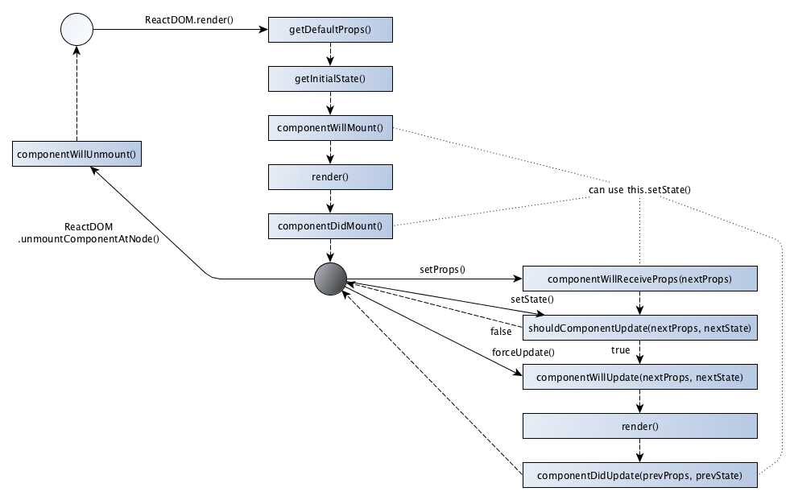
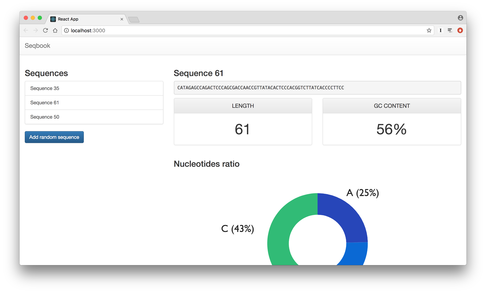

# Writing components

📌 Learning objectives:

- learn how to write React components
- understand the difference between state and props
- learn how to handle events
- know how to use existing React components


## Create React App

Create React apps with no build configuration:

- Start building an app directly
- No configuration hassle
- Great default settings
- Eject mode

``` bash
$ npm install -g create-react-app
```


## 🚀 Hands-on

1. Install `yarn`: https://yarnpkg.com/lang/en/docs/install/
2. Create a new React project:

``` bash
$ cd react
$ create-react-app seqbook
```

``` bash
$ cd seqbook
$ git init
$ git add . && git commit -m "Initial commit"
```


## ~/react/seqbook

> Seqbook is a DNA sequences book. Users will be able to manipulate sequences,
> fetch sequences from an online database, and visualize different metrics.

```
.
├── README.md
├── node_modules/
├── package.json
├── public/
├── src/
└── yarn.lock
```


## 


## The JSX syntax

JSX is an extension of the JavaScript syntax. More precisely, it is an alias for
`React.createElement()`.

**It is not HTML**, yet it is tag-based. React does not require JSX, but it is
much more convenient to use it!

<br>

Want to write your own JSX renderer? Read [WTF is
JSX](https://jasonformat.com/wtf-is-jsx/).


### Example please

``` javascript.player.transpiler
const simpleElement = <div />;

const complexElement = (
  <div
    message="hello"
    value={anything}
  >
    <p>42</p>
  </div>
);
```


### `React`

``` javascript
import React from 'react';
```

- `React.Component`: allows to create components, _i.e._ JavaScript classes that
  can be instantiated with JSX
- `React.PureComponent`: allows to create read-only components, _i.e._
  components only used for display purpose


### `ReactDOM`

``` javascript
import ReactDOM from 'react-dom';
```

- `ReactDOM.render()`: allows to render React components to the DOM, _i.e._ it
  converts components into HTML
- Provides many HTML-like components (DOM tags), _e.g._, `<div />`, `<span />`,
  etc


### Class component

``` javascript
// src/Item.js or src/Item/index.js

class Item extends React.Component {
  render() {
    return (
      <p>42</p>
    );
  }
}

export default Item;
```


#### Example

``` javascript.player.web
import React from 'react';
import ReactDOM from 'react-dom';

class Item extends React.Component {
  render() {
    return (
      <p>42</p>
    );
  }
}

ReactDOM.render(<Item />, document.querySelector('#app'));
```


### Stateless/functional component

```javascript
// src/Item/index.js

const Item = () => <li>42</li>;

export default Item;
```

<br>

- Fast, simple to read
- Should be preferred
- No lifecycle methods
- No internal state


#### Example

``` javascript.player.web
import React from 'react';
import ReactDOM from 'react-dom';

const Item = () => <li>42</li>;

ReactDOM.render(<Item />, document.querySelector('#app'));
```


### React component tree


### Composition

``` javascript.player.web
import React from 'react';
import ReactDOM from 'react-dom';

const Item = () => <li>42</li>;

const List = () => (
  <ul>
    <Item />
    <Item />
    <Item />
  </ul>
);

ReactDOM.render(<List />, document.querySelector('#app'));
```


### Lists and keys

```text
Warning: Each child in an array or iterator should have a
unique "key" prop. Check the render method of `List`. See
https://fb.me/react-warning-keys for more information.
```

A "key" is a special string attribute you need to include when creating lists of
elements. Keys help React identify which items have changed, are added or are
removed.

<br>

Documentation: [Lists and
Keys](https://facebook.github.io/react/docs/lists-and-keys.html)


#### Example

``` javascript.player.web
import React from 'react';
import ReactDOM from 'react-dom';

const Item = () => <li>42</li>;

const List = () => (
  <ul>
    <Item key="1" />
    <Item key="2" />
    <Item key="3" />
  </ul>
);

ReactDOM.render(<List />, document.querySelector('#app'));
```


### `<App />`

``` javascript.player.web
import React, { Component } from 'react';
import ReactDOM from 'react-dom';

class App extends Component {
  render() {
    return (
      <div className="App">
        <div className="App-header">
          {/*  */}
          <h2>Welcome to React</h2>
        </div>
        <p className="App-intro">
          To get started, edit <code>src/App.js</code> and save to reload.
        </p>
      </div>
    );
  }
}

ReactDOM.render(<App />, document.querySelector('#app'));
```


## 🚀 Hands-on

1. Remove a few useless files:

    ``` bash
    $ git rm src/*.css src/*.svg
    ```

2. Remove corresponding `import` (see `yarn start` output)
3. Add Bootstrap CSS:

    ``` bash
    $ yarn add bootstrap@3
    ```

    ``` js
    // src/index.js
    import 'bootstrap/dist/css/bootstrap.css';
    import 'bootstrap/dist/css/bootstrap-theme.css';
    ```


### Exercise 2.1

1. Create a `Header` component with a Bootstrap **navbar** (brand image)
2. Import and use it in the existing `App` component


### Solution 2.1 (The component)

``` javascript
import React from 'react';

const Header = () =>
  <nav className="navbar navbar-default navbar-fixed-top">
    <div className="container-fluid">
      <div className="navbar-header">
        <a className="navbar-brand" href="/">
          Seqbook
        </a>
      </div>
    </div>
  </nav>;

export default Header;
```


### Solution 2.1 (Usage)

``` javascript
class App extends Component {
  render() {
    return (
      <div className="App">
        <Header />

        <div className="container-fluid">
          <p className="App-intro">
            To get started, edit <code>src/App.js</code> and save to reload.
          </p>
        </div>
      </div>
    );
  }
}
```


## About imports


### Index or not index?

A component can be written in

- `src/ComponentName.js`
- `src/ComponentName/index.js`

<br>

It will be equally imported with:

``` js
import ComponentName from './ComponentName';
```

Prefer the directory approach (explained later).


### Absolute imports

Instead of using relative imports, we can use absolute imports, which is more
convenient:

```js
// relative
import Header from './Header';

// absolute
import Header from 'Header';
```

With Create React App, set the `NODE_PATH` variable:

```bash
$ echo 'NODE_PATH=src/' > .env
```


## Dealing with data<br>(props)


### What are props?

**Props** are **read-only** arbitrary inputs.


All React components must act like pure functions with respect to their props.
"Pure" functions do not attempt to change their inputs and always return the
same results for the same inputs.


### Props & class component

In a class-based component, props are accessible _via_ the `this.props`
attribute:

``` javascript
class Item extends React.Component {
  // ...

  render() {
    return (
      <p>{this.props.value}</p>
    );
  }
}
```

``` javascript
<Item value=42 />
```


### Props & stateless component

In a functional-based component, props are the first argument of the function:

``` javascript
const Item = (props) => <li>{props.value}</li>;

const List = ({ values }) => (
  {values.map(val => <Item value={val} />)}
);
```

``` javascript
<List values={[42, 'foo', 'bar', 123]} />
```


### Typechecking With PropTypes

```bash
$ yarn add prop-types
```

```js
import PropTypes from 'prop-types';
```

`PropTypes` exports a range of validators that can be used to make sure the data
you receive is valid.

<br>

Documentation: [Typechecking With
PropTypes](https://facebook.github.io/react/docs/typechecking-with-proptypes.html)


#### PropTypes on class-based components

```js
class Item extends React.Component {
}

Item.propTypes = {
  title: PropTypes.string.isRequired,
};
```

or

```js
class Item extends React.Component {
  static propTypes = {
    title: PropTypes.string.isRequired,
  };
}
```


#### PropTypes on functional components

```js
const Item = (props) => <li>{props.title}</li>;

Item.propTypes = {
  title: PropTypes.string.isRequired,
};
```


## 🚀 Hands-on


### Exercise 2.2

1. Create a `Item` component rendering a `title` prop
2. Create a `List` component that renders a list of elements (named
   `sequences`). Each entry must be an instance of `Item`:

   ``` javascript
   const sequences = ['foo', 'bar', 'baz'];

   // <List sequences={sequences} />
   ```

3. Use Bootstrap **list-group** style


### Solution 2.2 – `List`

```
const List = ({ sequences }) => {
  if (sequences.length === 0) {
    return <p>no sequences</p>;
  }

  return (
    <div className="list-group">
      {sequences.map(s => <Item key={s} title={s} />)}
    </div>
  );
};

List.propTypes = {
  sequences: PropTypes.arrayOf(PropTypes.string).isRequired,
};
```


### Solution 2.2 – `Item`

```js
import React from 'react';
import PropTypes from 'prop-types';

const Item = ({ title }) => (
  <li className="list-group-item">{title}</li>
);

Item.propTypes = {
  title: PropTypes.string.isRequired,
};

export default Item;
```


### Exercise 2.3

1. Add the `List` component to the `App` component in a `col-md-4` column (add a
   fluid container and a row too)
2. Add a `src/styles.css` file for the body padding (due to Bootstrap navbar)


### Solution 2.3

```js
render() {
  return (
    <div className="App">
      <Header />

      <div className="container-fluid">
        <div className="row">
          <div className="col-md-4">
            <h3>Sequences</h3>
            <List sequences={['ATCG', 'ATCGATTT']} />
          </div>
        </div>
      </div>
    </div>
  );
}
```


## Dealing with data<br>(state)


### What is state?

State allows React components to change their output over time in response to
user actions, network responses, etc. State is similar to props, but it is
private and fully controlled by the component.

State can only be used in class-based components.

React provides a `setState()` method to act on the state, never mutate it by
yourself.


### Example

``` javascript.player.web
import React from 'react';
import ReactDOM from 'react-dom';

class App extends React.Component {
  constructor(props) {
    super(props);

    this.state = { value: 42 };
  }

  render() {
    return (
      <p>State value is: {this.state.value}</p>
    );
  }
}

ReactDOM.render(<App />, document.querySelector('#app'));
```


## 🚀 Hands-on


### Exercise 2.4

1. Move the `sequences` list to the `App` component state


### Exercise 2.5

1. Require the `seq-utils` module created previously:

    ```bash
    $ yarn add file:../seq-utils/seq-utils-1.0.0.tgz
    ```

2. Use this module to populate the `sequences` state attribute with random
   sequences


## Props vs State

Props are chunks of app state that are passed into your component from a parent
component.

State is something that changes within a component, which could be used as
props for its children.

Yet, both are plain JS objects, deterministic and trigger a render update when
they change.

<br>

Further explanation: [Props vs
State](https://github.com/uberVU/react-guide/blob/master/props-vs-state.md)


## Receiving user's events


### Events

Most components have function props to handle events. Events are "camelCased"
and you have to pass functions as event handlers.

When passing functions in JSX callbacks, you have to be careful about the
meaning of `this`.

<br>

Documentation: [Handling
Events](https://facebook.github.io/react/docs/handling-events.html)


### Example

``` javascript.player.web
import React from 'react';
import ReactDOM from 'react-dom';

class App extends React.Component {
  constructor(props) {
    super(props);

    this.state = { value: 42 };
    // Uncomment the line below to be able to increment the `value`.
    //this.handleOnClick = this.handleOnClick.bind(this);
  }

  handleOnClick() {
    this.setState(prevState => ({ value: prevState.value + 1 }));
  }

  render() {
    return (
      <div>
        <p>State value is: {this.state.value}</p>
        <button onClick={this.handleOnClick}>increment</button>
      </div>
    );
  }
}

ReactDOM.render(<App />, document.querySelector('#app'));
```


### Alternative/Better syntax

Using the [Babel `transform-class-properties`
plugin](https://babeljs.io/docs/plugins/transform-class-properties/)
(enabled on Create React App).

``` javascript.player.web
import React from 'react';
import ReactDOM from 'react-dom';

class App extends React.Component {
  constructor(props) {
    super(props);

    this.state = { value: 42 };
  }

  handleOnClick = () => {
    this.setState(prevState => ({ value: prevState.value + 1 }));
  }

  render() {
    return (
      <div>
        <p>State value is: {this.state.value}</p>
        <button onClick={this.handleOnClick}>increment</button>
      </div>
    );
  }
}

ReactDOM.render(<App />, document.querySelector('#app'));
```


## Forms

How to get user's input data with React?

<br>

Documentation: [Forms](https://facebook.github.io/react/docs/forms.html)


### Controlled components

In HTML, form elements (`input`, `textarea`, etc.) maintain their own state. In
React, we usually keep state in the component. A controlled component is a form
element whose value is controlled by React.


#### Example

``` javascript.player.web
import React from 'react';
import ReactDOM from 'react-dom';

class Search extends React.Component {
  constructor(props) {
    super(props);
    this.state = { search: '' };
  }

  handleOnChange = event => {
    // Commenting the line below should help you understand why
    // the `input` is controlled.
    this.setState({ search: event.target.value });
  };

  render() {
    return (
      <div>
        <input
          value={this.state.search}
          onChange={this.handleOnChange}
          type="text"
        />
        <p>Value is: {this.state.search}</p>
      </div>
    );
  }
}

ReactDOM.render(<Search />, document.querySelector('#app'));
```


### Uncontrolled components

Uncontrolled components means form data is handled by the DOM itself, but it is
rarely useful.

<br>

Documentation: [Uncontrolled
components](https://facebook.github.io/react/docs/uncontrolled-components.html)


## 🚀 Hands-on


### Exercise 2.6

1. Add a button below the `List` to add new (random) sequences to it
2. Allow to select a list item and display its information on the right side


### Exercise 2.7

1. Create a `Sequence` component that renders a sequence (`PropTypes.string`):

    ```jinja
    <pre>
      <code>{sequence}</code>
    </pre>
    ```

2. Add a `styles.css` file for this component with the following content:

    ```css
    .Sequence {
      word-break: normal;
    }
    ```

3. Use it on the right side of the interface


### Checkpoint #1


##  Divide & Conquer

- Decompose your UI into different main components (_e.g._, `Header`, `Footer`)
- Break each main component into smaller, specialized, components
- Create small components that are reusable (_e.g._, `Button`, `Card`)


## 🚀 Hands-on

Let's have fun with React components!


### Exercise 2.8

1. Create a `Card` component (in `src/ui/`) that can display a title, a value
   and *optionally* a unit. Values can be strings or numbers
2. Use Boostrap `panel` to style this `Card` component


### Exercise 2.9

1. Create a `SequenceView` class-based component that takes a `sequence` object
   as prop. It should render the name of the sequence and the sequence of
   nucleotides using the `Sequence` component
2. Use it in your `App.js`


### Exercise 2.10

1. Create a `Length` component (in `src/widgets/`) that renders a `Card`
   displaying the length of the sequence (`PropTypes.string`)
2. Add it to your `SequenceView` component


### Checkpoint #2


### Exercise 2.11

Add a new method `getGCContent()` to `SequenceView` that takes the sequence
string as input and returns its [GC content](https://en.wikipedia.org/wiki/GC-content).

You should call `contentATGC()` on a `Seq` instance, then compute the result of
the GC content formula:

```js
const atgc = seq.contentATGC();

const gc = (atgc['G'] + atgc['C']) /
  (atgc['A'] + atgc['T'] + atgc['G'] + atgc['C']);
```


### Exercise 2.12

Create a new `Card` next to the `Length` one to display the result of
`getGCContent()`. The title should be "GC content" and the unit "%".


### Checkpoint #3


## Advanced concepts


### Lifecycle methods

Each component has several **lifecycle methods** that you can override to run
code at particular times in the process:

- Mounting: when an instance of a component is being created and inserted into
the DOM
- Updating: when a component is being re-rendered, triggered by changes to props
  or state
- Unmounting: when a component is being removed from the DOM





### Lifting state up

There should be a single **source of truth** for any data that changes in a
React application.

Most of the time, several components need to reflect the same changing data.
Instead of duplicating the data, lift the shared state up to the closest common
ancestor.


#### Example


`C` and `D` share the same data via "root" as the common ancestor. This
introduces **coupling** but Redux solves it.


### CSS classes

Every React component has a special `className` attribute to add CSS classes to
it, you cannot use `class`.

```js
const Component = (props) => (
  <div className="Component">
    // ...
  </div>
);
```

It is advised to use the same `className` as the component name but you can do
whatever you like.


#### `classnames`

The [classnames](https://github.com/JedWatson/classnames) library is very useful
to deal with different CSS class names in JavaScript:

``` js
import classNames from 'classnames';

classNames('foo', 'bar');
// => 'foo bar'

classNames('foo', { bar: true });
// => 'foo bar'

classNames('foo', { bar: false });
// => 'foo'
```


## Unit testing/Snapshots

Create React App bundles [Jest](https://facebook.github.io/jest/) and you can
run the test suite with `yarn test` (calling `jest` directly won't work).


### Snapshot testing

Also known as "better than nothing" testing. It uses a test renderer to quickly
generate a serializable value for your React tree and compares it to a
reference.

<br>

``` bash
$ yarn add --dev react-test-renderer
```

<br>

Documentation: [Snapshot
testing](https://facebook.github.io/jest/docs/en/snapshot-testing.html)


#### Example of a snapshot test

```js
import React from 'react';
import renderer from 'react-test-renderer';

import Item from './Item';

it('renders correctly', () => {
  const tree = renderer.create(
    <Item title="item title" onSelect={() => {}} />
  ).toJSON();
  expect(tree).toMatchSnapshot();
});
```


#### Example of a reference file

Jest creates snapshot reference files that must be put under version control!

```bash
$ cat src/List/__snapshots__/Item.test.js.snap
// Jest Snapshot v1, https://goo.gl/fbAQLP

exports[`renders correctly 1`] = `
<button
  className="list-group-item"
  onClick={[Function]}
>
  item title
</button>
`;
```


#### Updating reference files

If you modify your component, snapshot tests will not pass. You have to update
the snapshot reference files:

```bash
$ yarn test -- --updateSnapshot
```

```
Snapshot Summary
 › 1 snapshot updated in 1 test suite.
```


### Enzyme

[Enzyme](http://airbnb.io/enzyme/) is a JavaScript Testing utility for React, by
Airbnb.

<br>

```bash
$ yarn add enzyme jest-enzyme --dev
```

<br>

Documentation: http://airbnb.io/enzyme/


#### Enzyme API

- `shallow()`: use it if you want to test components in isolation from the child
  components they render
- `mount()`: useful when you have components that may interact with DOM APIs, or
  may require the full lifecycle in order to fully test the component
- `render()`: I do not think I have ever used it


#### Example with `shallow()`

```js
import React from 'react';
import { shallow } from 'enzyme';
import { generate } from 'seq-utils';

import List from './index';

it('renders items', () => {
  const sequences = [ generate(), generate() ];
  const wrapper = shallow(
    <List sequences={sequences} onSelectSequence={() => {}} />
  );

  expect(wrapper.find(Item)).toHaveLength(sequences.length);
});
```


#### Example with `mount()`

```js
it('receives event when Item is selected', () => {
  const sequence = generate();
  const spy = jest.fn();

  const wrapper = mount(
    <List sequences={[sequence]} onSelectSequence={spy} />
  );

  expect(spy).not.toHaveBeenCalled();
  wrapper.find('button').simulate('click');
  expect(spy).toHaveBeenCalled();
});
```


### Code coverage

Use the command below to generate code coverage:

```bash
$ yarn test -- --coverage
```

You can open `coverage/lcov-report/index.html` to get the HTML report (which is
always generated).


## 🚀 Hands-on


### Exercise 2.13

1. Add snapshot tests  for the following components: `Card`, `Item` and `Length`
2. Add tests with `shallow()` and `mount()` for the `List` component
3. Try to improve the overall code coverage (if time allows)


### Exercise 2.14

Create a `Complement` widget that renders a `Sequence` configured with the
complement of a sequence passed to `Complement` as a prop.

You can get the complement of a `Seq` instance by calling `complement()` on it,
and get the sequence as string by calling `sequence()`.


### Checkpoint #4




### Exercise 2.15

Create a `FractionalContent` widget that renders a pie chart showing the content
of a sequence, using [Victory](http://formidable.com/open-source/victory/docs).

Data for the chart can be retrieved by calling `fractionalContentATGC()` on a
`Seq` instance, which returns a JavaScript hash map:

```js
{
  'A': 0.375,
  'T': 0.375,
  'G': 0.125,
  'C': 0.125
}
```


### Checkpoint #5


