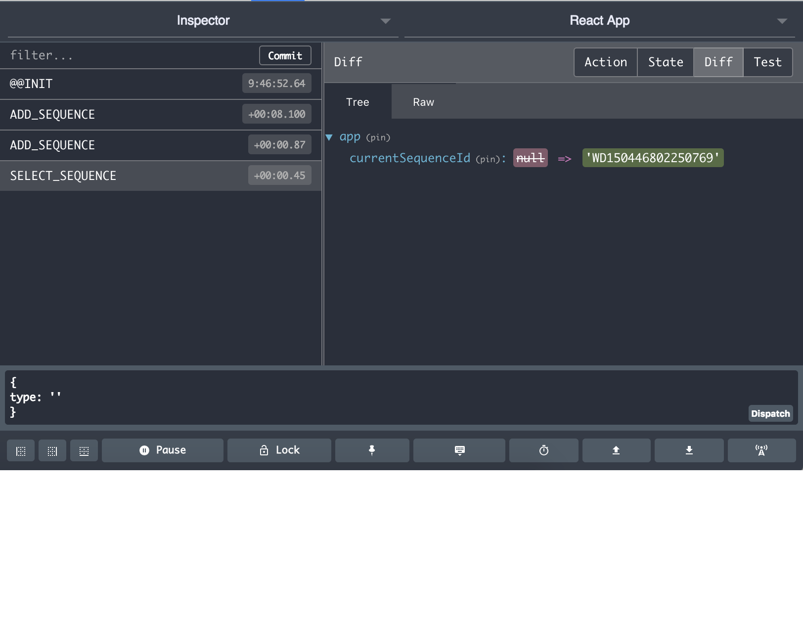
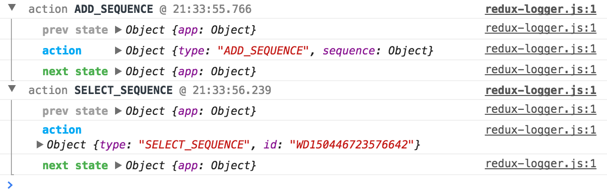
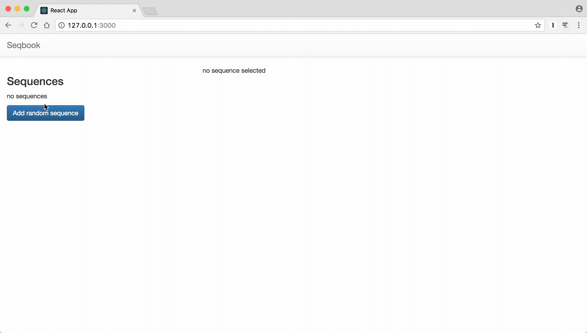

# Managing application state

📌 Learning objectives:

- understand what Redux is
- learn how to write reducers, action types/creators
- know how to use Redux with React


## What is Redux?

Redux is a predictable **state container** for JavaScript apps. It can be used
without React and React does not require it.

Yet, it helps build flexible and maintainable applications.


### Trade-off

Redux asks you to describe:

- application state as plain objects and arrays
- changes in the system as plain objects
- the logic for handling changes as pure functions


### State tree

The state of your whole application is stored in an object tree within a single
**store**. This is what Redux calls the "single source of truth".


### Immutability

The only way to mutate the state is to emit an **action**, an object describing
what happened. The state is read-only.


### Pure functions

To specify how the state tree is transformed by actions, you write pure
**reducers**.

These are called "pure" because they do nothing but return a value based on
their parameters. They have no side effects into any other part of the system.


## Writing reducers, action creators and actions


### Actions

Actions are payloads of information that send data from your application to your
store. Actions are sent to the store using `store.dispatch()`:

```js
const MY_ACTION = 'MY_ACTION';
const MY_ACTION_WITH_ARGS = 'MY_ACTION_WITH_ARGS';

store.dispatch({ type: MY_ACTION });
store.dispatch({ type: MY_ACTION_WITH_ARGS, id, name });
```


### Action creators

Action creators are functions that create actions:

```js
export const myAction = () => ({ type: MY_ACTION });

export cont myActionWithArgs = (id, name) => ({
  type: MY_ACTION_WITH_ARGS,
  id,
  name,
});

dispatch(myAction());
dispatch(myActionWithArgs(123, 'John Doe'));
```


### Reducers

The job of reducers is to describe how the application's state changes in
response to something that happened (which is described by an action):

```js
// src/reducers/app.js

const initialState = {};

export default function reducer(state = initialState, action = {}) {
  switch (action.type) {
    case MY_ACTION:
      // ...

    default:
      return state;
  }
}
```


### Store

The store has the following responsibilities:

- holds application state
- allows access to state via `getState()`
- allows state to be updated via `dispatch(action)`
- registers listeners via `subscribe(listener)`
- handles unregistering of listeners via the function returned by
  `subscribe(listener)`


## Ducks!

[Ducks](https://github.com/erikras/ducks-modular-redux) is a proposal for
bundling reducers, action types and actions when using Redux. A Ducks module...

- MUST `export default` a `reducer()` function
- MUST `export` its action creators as functions
- MAY export its action types as `UPPER_SNAKE_CASE`, if an external reducer
  needs to listen for them, or if it is a published reusable library


### Example of a Duck(s)

```js
const initialState = {};

// actions (types)
const ACTION = 'ACTION';

// action creators
export const action = () => {
  return { type: ACTION };
};

// reducer
export default function reducer(state = initialState, action = {}) {
  // ...
}
```


## Connecting React & Redux

``` bash
$ yarn add react-redux redux
```


### `<Provider />`

```js
// src/index.js
// ...

const store = configureStore();

ReactDOM.render(
  <Provider store={store}>
    <App />
  </Provider>,
  document.getElementById('root')
);
```

What does this `configureStore()` method do?


### Configuring the store

``` js
// src/store/configureStore.js
import { applyMiddleware, createStore } from 'redux';

import rootReducer from 'reducers';

const middleware = [];
const createStoreWithMiddleware = applyMiddleware(...middleware)(
  createStore
);

export default function configureStore(initialState) {
  const store = createStoreWithMiddleware(rootReducer, initialState);

  return store;
}
```

Heh. What is this `rootReducer`?


### The root reducer

``` js
// src/reducers/index.js
import { combineReducers } from 'redux';

import app from './app';
// ...other import for reducers

export default combineReducers({
  app,
  // ...other reducers
});
```


### `connect()`

React Redux provides a `connect()` High Order Component (HOC) that allows to
connect any React component to the application store.

```js
// src/App.js
// ...

export default connect(mapStateToProps, mapDispatchToProps)(App);
```


### `map*ToProps()`

- `mapStateToProps()` tells how to transform the current Redux store state into
  the props you want to pass to the component wrapped with `connect()`
- `mapDispatchToProps()` receives the `dispatch()` method and returns
  callback props that you want to inject into the component


### Presentational vs Container Components

Containers know about data, its shape and where it comes from. We also call them
"connected" components.

Presentational components are concerned with how the things look, with no
internal state (functional components).


|                | Presentational                   | Container            |
|----------------|----------------------------------|----------------------|
| Aware of Redux | No                               | Yes
| To read data   | Read data from props             | Subscribe to Redux state
| To change data | Invoke callbacks from props      | Dispatch Redux actions
| Are written    | By hand	                        | Usually generated by React Redux


### Directory structure

```
src/App
├── index.js        # Container/Connected component
├── presenter.js    # Presentational component
└── styles.css
```

``` js
// src/App/index.js
import { connect } from 'react-redux';

import { addSequence } from 'reducers/app';
import App from './presenter';

const mapStateToProps = state => { /* ... */ };

const mapDispatchToProps = dispatch => { /* ... */ };

export default connect(mapStateToProps, mapDispatchToProps)(App);
```


## (Redux) Dev Tools


### Browser Extension




#### Installing the browser Extension

Install the [Redux DevTools
Extension](https://github.com/zalmoxisus/redux-devtools-extension) in your
browser.

``` js
// src/store/configureStore.js

export default function configureStore(initialState) {
  const store = createStoreWithMiddleware(
    rootReducer,
    initialState,
    typeof window !== 'undefined' &&
    window.__REDUX_DEVTOOLS_EXTENSION__ &&
    window.__REDUX_DEVTOOLS_EXTENSION__()
  );

  return store;
}
```


### Logger Middleware




#### Installing the Logger Middleware

``` bash
$ yarn add --dev redux-logger
```

``` js
// src/store/configureStore.js

const isNotProduction = process.env.NODE_ENV !== 'production';

const middleware = [];

if (isNotProduction) {
  const { logger } = require('redux-logger');

  middleware.push(logger);
}
```


## 🚀 Hands-on


### Exercise 3.1

1. Install Redux, React Redux and configure it into your application (install
   the devtools to ease your life)
2. Create a reducer in `src/reducers/app.js`
3. Create the actions to add, remove and select sequences and replace the
   existing code, _i.e._ move the state from `src/App.js` to your reducer
4. Use the directory structure for the `App` component


### Checkpoint #6




## Unit testing


### Presentational components

Now, your test suite should fail because you are testing the container/connected
component.

Another advantage of the "directory structure" for components is that you can
test the presentational components in isolation.


#### Example

``` js
// src/App/presenter.test.js
import React from 'react';
import { shallow } from 'enzyme';

import App from './presenter';

it('renders without crashing', () => {
  const wrapper = shallow(
    <App
      sequences={[]}
      onAddSequence={jest.fn()}
      onRemoveSequence={jest.fn()}
      onSelectSequence={jest.fn()}
    />
  );
  expect(wrapper.hasClass('App')).toEqual(true);
});
```


### Container components

You can `export` and test the `map*ToProps()`.

If you want to write "integration tests", you can `mount()` the component you
want to test into `<Provider />` and manually create a `store`.


#### Example

``` js
import React from 'react';
import { mount } from 'enzyme';
import { Provider } from 'react-redux';

import configureStore from 'store/configureStore';
import Home from './index';

it('renders without crashing', () => {
  const store = configureStore();
  const wrapper = mount(
    <Provider store={store}>
      <Home />
    </Provider>
  );
  expect(wrapper.hasClass('Home')).toEqual(true);
});
```


### Redux

Pure functions are easily testable, _i.e._ reducers and action creators can be
fully unit tested (with Jest).

``` js
describe('reducer()', () => {
  it('initializes properly', () => {
    const state = reducer(undefined);
    expect(state).toEqual({
      currentSequenceId: null,
      sequences: [],
    });
  });

  it('can add a sequence', () => {
    const sequence = generate();
    const state = reducer(undefined, addSequence(sequence));
    expect(state.sequences).toContain(sequence);
  });

  // ...
});
```


## Refactoring with selectors

Selectors can compute derived data, allowing Redux to store the minimal possible
state. They are composable and they can be used as input to other selectors.

<br>

See also: the [reselect](https://github.com/reactjs/reselect) library.


### The problem

```js
const mapStateToProps = (state) => {
  return {
    incompleteItems: state.listOfItems.filter((item) => {
      return !item.completed;
    });
  };
};
```

- Implementation of `incompleteItems` may change
- Computation logic occurs in `mapStateToProps()`
- Cannot memoize the values of `incompleteItems`


### The solution

Introduce selectors into your reducers:

```js
const getIncompleteItems = (state) => {
  return state.listOfItems.filter((item) => {
    return !item.completed;
  });
};
```

```js
const mapStateToProps = (state) => {
  return {
    incompleteItems: getIncompleteItems(state),
  };
};
```


## 🚀 Hands-on


### Exercise 3.2

1. Add unit tests for the `app` reducer (`app.test.js`)
2. Add a `getCurrentSequence()` selector and use it in your connected `App`
   component
