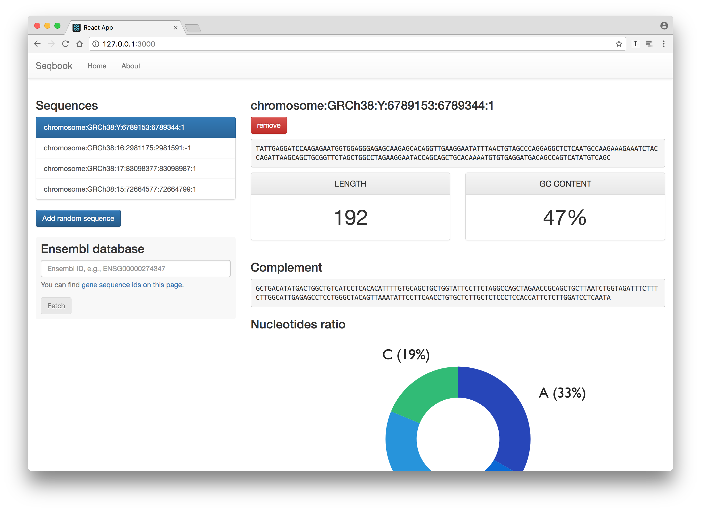

  
  <h1>Great user interfaces with React</h1>

## Table of Contents

- [Introduction](1-introduction.md#introduction)
  - [What is React?](1-introduction.md#what-is-react)
  - [What is Flux?](1-introduction.md#what-is-flux)
  - [What is Redux?](1-introduction.md#what-is-redux)
  - [Modern JavaScript](1-introduction.md#modern-javascript)
    - [ES5](1-introduction.md#es5)
    - [ES2015 (ES6)](1-introduction.md#es2015-es6)
      - [Block scoped declarations](1-introduction.md#block-scoped-declarations)
      - [Block scoped declarations – Example](1-introduction.md#block-scoped-declarations--example)
      - [Arrow functions](1-introduction.md#arrow-functions)
      - [Destructuring](1-introduction.md#destructuring)
      - [Imports/Exports](1-introduction.md#importsexports)
      - [Imports – Example](1-introduction.md#imports--example)
      - [Exports – Example](1-introduction.md#exports--example)
      - [Template literals (strings)](1-introduction.md#template-literals-strings)
      - [Tagged template literals](1-introduction.md#tagged-template-literals)
      - [Default parameters](1-introduction.md#default-parameters)
      - [Classes](1-introduction.md#classes)
      - [Dynamic object keys](1-introduction.md#dynamic-object-keys)
      - [Array spread](1-introduction.md#array-spread)
    - [ESNext](1-introduction.md#esnext)
      - [Static class properties](1-introduction.md#static-class-properties)
      - [Object Spread](1-introduction.md#object-spread)
      - [Async/Await](1-introduction.md#asyncawait)
      - [Async/Await – Example](1-introduction.md#asyncawait--example)
  - [🚀 Hands-on](1-introduction.md#-hands-on)
    - [Exercise 1.1](1-introduction.md#exercise-11)
    - [Solution 1.1](1-introduction.md#solution-11)
  - [Unit testing](1-introduction.md#unit-testing)
    - [Jest 101](1-introduction.md#jest-101)
    - [Jest + Babel = ❤️](1-introduction.md#jest--babel--)
    - [It works™](1-introduction.md#it-works%E2%84%A2)
  - [🚀 Hands-on](1-introduction.md#-hands-on-1)
    - [Exercise 1.2](1-introduction.md#exercise-12)
    - [Solution 1.2](1-introduction.md#solution-12)
  - [Transpilation with Babel](1-introduction.md#transpilation-with-babel)
    - [NPM scripts](1-introduction.md#npm-scripts)
    - [Create a NPM module (1/2)](1-introduction.md#create-a-npm-module-12)
    - [Create a NPM module (2/2)](1-introduction.md#create-a-npm-module-22)
    - [Publish a NPM module](1-introduction.md#publish-a-npm-module)
  - [🚀 Hands-on](1-introduction.md#-hands-on-2)
    - [Exercise 1.3](1-introduction.md#exercise-13)
    - [Exercise 1.4](1-introduction.md#exercise-14)
  - [Code coverage](1-introduction.md#code-coverage)
- [Writing components](2-writing-components.md#writing-components)
  - [Create React App](2-writing-components.md#create-react-app)
  - [🚀 Hands-on](2-writing-components.md#-hands-on)
  - [~/react/seqbook](2-writing-components.md#reactseqbook)
  - [*](2-writing-components.md#)
  - [The JSX syntax](2-writing-components.md#the-jsx-syntax)
    - [Example please](2-writing-components.md#example-please)
    - [`React`](2-writing-components.md#react)
    - [`ReactDOM`](2-writing-components.md#reactdom)
    - [Class component](2-writing-components.md#class-component)
      - [Example](2-writing-components.md#example)
    - [Stateless/functional component](2-writing-components.md#statelessfunctional-component)
      - [Example](2-writing-components.md#example-1)
    - [React component tree](2-writing-components.md#react-component-tree)
    - [Composition](2-writing-components.md#composition)
    - [Lists and keys](2-writing-components.md#lists-and-keys)
      - [Example](2-writing-components.md#example-2)
    - [`<App />`](2-writing-components.md#app-)
  - [🚀 Hands-on](2-writing-components.md#-hands-on-1)
    - [Exercise 2.1](2-writing-components.md#exercise-21)
    - [Solution 2.1 (The component)](2-writing-components.md#solution-21-the-component)
    - [Solution 2.1 (Usage)](2-writing-components.md#solution-21-usage)
  - [About imports](2-writing-components.md#about-imports)
    - [Index or not index?](2-writing-components.md#index-or-not-index)
    - [Absolute imports](2-writing-components.md#absolute-imports)
  - [Dealing with data (props)](2-writing-components.md#dealing-with-databrprops)
    - [What are props?](2-writing-components.md#what-are-props)
    - [Props & class component](2-writing-components.md#props--class-component)
    - [Props & stateless component](2-writing-components.md#props--stateless-component)
    - [Typechecking With PropTypes](2-writing-components.md#typechecking-with-proptypes)
      - [PropTypes on class-based components](2-writing-components.md#proptypes-on-class-based-components)
      - [PropTypes on functional components](2-writing-components.md#proptypes-on-functional-components)
  - [🚀 Hands-on](2-writing-components.md#-hands-on-2)
    - [Exercise 2.2](2-writing-components.md#exercise-22)
    - [Solution 2.2 – `List`](2-writing-components.md#solution-22--list)
    - [Solution 2.2 – `Item`](2-writing-components.md#solution-22--item)
    - [Exercise 2.3](2-writing-components.md#exercise-23)
    - [Solution 2.3](2-writing-components.md#solution-23)
  - [Dealing with data (state)](2-writing-components.md#dealing-with-databrstate)
    - [What is state?](2-writing-components.md#what-is-state)
    - [Example](2-writing-components.md#example-3)
  - [🚀 Hands-on](2-writing-components.md#-hands-on-3)
    - [Exercise 2.4](2-writing-components.md#exercise-24)
    - [Exercise 2.5](2-writing-components.md#exercise-25)
  - [Props vs State](2-writing-components.md#props-vs-state)
  - [Receiving user's events](2-writing-components.md#receiving-users-events)
    - [Events](2-writing-components.md#events)
    - [Example](2-writing-components.md#example-4)
    - [Alternative/Better syntax](2-writing-components.md#alternativebetter-syntax)
  - [Forms](2-writing-components.md#forms)
    - [Controlled components](2-writing-components.md#controlled-components)
      - [Example](2-writing-components.md#example-5)
    - [Uncontrolled components](2-writing-components.md#uncontrolled-components)
  - [🚀 Hands-on](2-writing-components.md#-hands-on-4)
    - [Exercise 2.6](2-writing-components.md#exercise-26)
    - [Exercise 2.7](2-writing-components.md#exercise-27)
    - [Checkpoint #1](2-writing-components.md#checkpoint-1)
  - [Divide & Conquer](2-writing-components.md#divide--conquer)
  - [🚀 Hands-on](2-writing-components.md#-hands-on-5)
    - [Exercise 2.8](2-writing-components.md#exercise-28)
    - [Exercise 2.9](2-writing-components.md#exercise-29)
    - [Exercise 2.10](2-writing-components.md#exercise-210)
    - [Checkpoint #2](2-writing-components.md#checkpoint-2)
    - [Exercise 2.11](2-writing-components.md#exercise-211)
    - [Exercise 2.12](2-writing-components.md#exercise-212)
    - [Checkpoint #3](2-writing-components.md#checkpoint-3)
  - [Advanced concepts](2-writing-components.md#advanced-concepts)
    - [Lifecycle methods](2-writing-components.md#lifecycle-methods)
    - [Lifting state up](2-writing-components.md#lifting-state-up)
      - [Example](2-writing-components.md#example-6)
    - [CSS classes](2-writing-components.md#css-classes)
      - [`classnames`](2-writing-components.md#classnames)
  - [Unit testing/Snapshots](2-writing-components.md#unit-testingsnapshots)
    - [Snapshot testing](2-writing-components.md#snapshot-testing)
      - [Example of a snapshot test](2-writing-components.md#example-of-a-snapshot-test)
      - [Example of a reference file](2-writing-components.md#example-of-a-reference-file)
      - [Updating reference files](2-writing-components.md#updating-reference-files)
    - [Enzyme](2-writing-components.md#enzyme)
      - [Enzyme API](2-writing-components.md#enzyme-api)
      - [Example with `shallow()`](2-writing-components.md#example-with-shallow)
      - [Example with `mount()`](2-writing-components.md#example-with-mount)
    - [Code coverage](2-writing-components.md#code-coverage)
  - [🚀 Hands-on](2-writing-components.md#-hands-on-6)
    - [Exercise 2.13](2-writing-components.md#exercise-213)
    - [Exercise 2.14](2-writing-components.md#exercise-214)
    - [Checkpoint #4](2-writing-components.md#checkpoint-4)
    - [Exercise 2.15](2-writing-components.md#exercise-215)
    - [Checkpoint #5](2-writing-components.md#checkpoint-5)
- [Managing application state](3-managing-application-state.md#managing-application-state)
  - [What is Redux?](3-managing-application-state.md#what-is-redux)
    - [Trade-off](3-managing-application-state.md#trade-off)
    - [State tree](3-managing-application-state.md#state-tree)
    - [Immutability](3-managing-application-state.md#immutability)
    - [Pure functions](3-managing-application-state.md#pure-functions)
  - [Writing reducers, action creators and actions](3-managing-application-state.md#writing-reducers-action-creators-and-actions)
    - [Actions](3-managing-application-state.md#actions)
    - [Action creators](3-managing-application-state.md#action-creators)
    - [Reducers](3-managing-application-state.md#reducers)
    - [Store](3-managing-application-state.md#store)
  - [Ducks!](3-managing-application-state.md#ducks)
    - [Example of a Duck(s)](3-managing-application-state.md#example-of-a-ducks)
  - [Connecting React & Redux](3-managing-application-state.md#connecting-react--redux)
    - [`<Provider />`](3-managing-application-state.md#provider-)
    - [Configuring the store](3-managing-application-state.md#configuring-the-store)
    - [The root reducer](3-managing-application-state.md#the-root-reducer)
    - [`connect()`](3-managing-application-state.md#connect)
    - [`map*ToProps()`](3-managing-application-state.md#maptoprops)
    - [Presentational vs Container Components](3-managing-application-state.md#presentational-vs-container-components)
    - [Directory structure](3-managing-application-state.md#directory-structure)
  - [(Redux) Dev Tools](3-managing-application-state.md#redux-dev-tools)
    - [Browser Extension](3-managing-application-state.md#browser-extension)
      - [Installing the browser Extension](3-managing-application-state.md#installing-the-browser-extension)
    - [Logger Middleware](3-managing-application-state.md#logger-middleware)
      - [Installing the Logger Middleware](3-managing-application-state.md#installing-the-logger-middleware)
  - [🚀 Hands-on](3-managing-application-state.md#-hands-on)
    - [Exercise 3.1](3-managing-application-state.md#exercise-31)
    - [Checkpoint #6](3-managing-application-state.md#checkpoint-6)
  - [Unit testing](3-managing-application-state.md#unit-testing)
    - [Presentational components](3-managing-application-state.md#presentational-components)
      - [Example](3-managing-application-state.md#example)
    - [Container components](3-managing-application-state.md#container-components)
      - [Example](3-managing-application-state.md#example-1)
    - [Redux](3-managing-application-state.md#redux)
  - [Refactoring with selectors](3-managing-application-state.md#refactoring-with-selectors)
    - [The problem](3-managing-application-state.md#the-problem)
    - [The solution](3-managing-application-state.md#the-solution)
  - [🚀 Hands-on](3-managing-application-state.md#-hands-on-1)
    - [Exercise 3.2](3-managing-application-state.md#exercise-32)
- [Consuming APIs](4-consuming-apis.md#consuming-apis)
  - [Fetch and HTTP](4-consuming-apis.md#fetch-and-http)
    - [Usage](4-consuming-apis.md#usage)
    - [Polyfills](4-consuming-apis.md#polyfills)
  - [Redux middleware](4-consuming-apis.md#redux-middleware)
    - [Redux Thunk](4-consuming-apis.md#redux-thunk)
      - [Example of a thunk](4-consuming-apis.md#example-of-a-thunk)
    - [Redux Persist](4-consuming-apis.md#redux-persist)
      - [Usage (with devtools extension)](4-consuming-apis.md#usage-with-devtools-extension)
      - [Usage (with devtools extension)](4-consuming-apis.md#usage-with-devtools-extension-1)
    - [Middleware vs Enhancers](4-consuming-apis.md#middleware-vs-enhancers)
  - [🚀 Hands-on](4-consuming-apis.md#-hands-on)
    - [The Plot](4-consuming-apis.md#the-plot)
    - [Exercise 4.1](4-consuming-apis.md#exercise-41)
    - [Exercise 4.2](4-consuming-apis.md#exercise-42)
    - [Checkpoint #7](4-consuming-apis.md#checkpoint-7)
    - [Exercise 4.3](4-consuming-apis.md#exercise-43)
  - [Routing](4-consuming-apis.md#routing)
    - [React Router](4-consuming-apis.md#react-router)
      - [Example](4-consuming-apis.md#example)
      - [404 - Not Found](4-consuming-apis.md#404---not-found)
  - [🚀 Hands-on](4-consuming-apis.md#-hands-on-1)
    - [Exercise 4.4](4-consuming-apis.md#exercise-44)
    - [Exercise 4.5](4-consuming-apis.md#exercise-45)
- [The sky is the limit!](5-the-sky-is-the-limit.md#the-sky-is-the-limit)
  - [Code formatting](5-the-sky-is-the-limit.md#code-formatting)
  - [Flow types](5-the-sky-is-the-limit.md#flow-types)
    - [On class-based components](5-the-sky-is-the-limit.md#on-class-based-components)
    - [On functional components](5-the-sky-is-the-limit.md#on-functional-components)
    - [Library Definition](5-the-sky-is-the-limit.md#library-definition)
    - [Flow coverage](5-the-sky-is-the-limit.md#flow-coverage)
  - [Performance optimization](5-the-sky-is-the-limit.md#performance-optimization)
  - [More on testing](5-the-sky-is-the-limit.md#more-on-testing)
    - [`redux-thunk` & `fetch`](5-the-sky-is-the-limit.md#redux-thunk--fetch)
      - [`redux-mock-store`](5-the-sky-is-the-limit.md#redux-mock-store)
      - [`fetch-mock`](5-the-sky-is-the-limit.md#fetch-mock)
    - [Hidden Jest features](5-the-sky-is-the-limit.md#hidden-jest-features)
  - [Server-Side Rendering (SSR)](5-the-sky-is-the-limit.md#server-side-rendering-ssr)
    - [Problem #1](5-the-sky-is-the-limit.md#problem-1)
    - [Problem #2](5-the-sky-is-the-limit.md#problem-2)
    - [Problem #3 (1/2)](5-the-sky-is-the-limit.md#problem-3-12)
    - [Problem #3 (2/2)](5-the-sky-is-the-limit.md#problem-3-22)
    - [Start the server](5-the-sky-is-the-limit.md#start-the-server)
    - [This was a Proof of Concept](5-the-sky-is-the-limit.md#this-was-a-proof-of-concept)

## License

This material is licensed under a [Creative Commons Attribution-ShareAlike 4.0
International (CC BY-SA 4.0)](https://creativecommons.org/licenses/by-sa/4.0/)
license. See the bundled [LICENSE](LICENSE) file for further information. Any
code provided (if not specifically indicated) is released by
[TailorDev](https://tailordev.fr) under a
[MIT](https://en.wikipedia.org/wiki/MIT_License) license.
